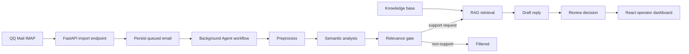

# Architecture

## Runtime Flow

## Backend

- `app/main.py`: FastAPI routes for email import, review, sending, knowledge management, and logs.
- `app/workflow.py`: LangGraph email workflow with preprocessing, semantic analysis, relevance filtering, retrieval, drafting, and review decision nodes.
- `app/knowledge.py`: document ingestion, chunking, hybrid retrieval, versioning, operation logs, and duplicate checks.
- `app/mail_client.py`: QQ IMAP/SMTP integration and attachment extraction.
- `app/llm_client.py`: OpenAI-compatible LLM client.
- `app/embedding_client.py`: OpenAI-compatible embedding client with local fallback.
- `app/store.py`: persistence adapter around SQLAlchemy models.

## Frontend

- `frontend/src/main.tsx`: React dashboard, queues, review tools, knowledge base UI, run logs, and settings.
- `frontend/src/styles.css`: enterprise-style dashboard layout and responsive behavior.

## Agent Design

The system is intentionally cost-aware:

- Low-cost preprocessing runs before external model calls.
- Platform/security notifications are filtered before RAG and drafting.
- RAG retrieval combines semantic similarity, keyword overlap, and category match.
- Each email tracks token usage, LLM calls, RAG latency, and estimated cost.
- Missing API keys fall back to local rules and local hash embeddings so the app remains runnable.
