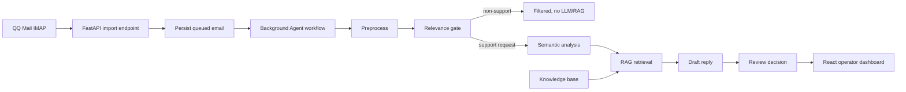

# Architecture

## Runtime Flow

## Backend

- `app/main.py`: FastAPI routes for email import, review, sending, knowledge management, and logs.
- `app/workflow.py`: LangGraph email workflow with preprocessing, semantic analysis, relevance filtering, retrieval, drafting, and review decision nodes.
- `app/knowledge.py`: document ingestion, chunking, hybrid retrieval, versioning, operation logs, and duplicate checks.
- `app/mail_client.py`: QQ IMAP/SMTP integration and attachment extraction.
- `app/llm_client.py`: OpenAI-compatible LLM client.
- `app/embedding_client.py`: OpenAI-compatible embedding client with local fallback.
- `app/store.py`: persistence adapter around SQLAlchemy models.

## Frontend

- `frontend/src/main.tsx`: React dashboard, queues, review tools, knowledge base UI, run logs, and settings.
- `frontend/src/styles.css`: enterprise-style dashboard layout and responsive behavior.

## Agent Design

The email Agent is implemented as a LangGraph `StateGraph` in `app/workflow.py`.
The graph state carries the current `EmailRecord` plus runtime options such as
`use_llm`, and each node returns partial state updates that LangGraph merges into
the next node.

Node flow:

1. `preprocess`: detect language, attachments, and low-cost risk signals.
2. `relevance_gate`: filter non-support/platform notification emails before any LLM or RAG call.
3. `semantic_analysis`: classify category, confidence, and risk using LLM with rule fallback.
4. `retrieve`: run pgvector semantic recall, then rerank candidates with keyword and category signals.
5. `draft`: generate a customer reply draft using LLM with a structured fallback.
6. `review`: route low-risk grounded replies to one-click sending and others to human review.

The system is intentionally cost-aware:

- Low-cost preprocessing runs before external model calls.
- Platform/security notifications are filtered before RAG and drafting.
- RAG retrieval uses PostgreSQL + pgvector for semantic candidate recall, then reranks with semantic similarity, keyword overlap, and category match.
- Each email tracks token usage, LLM calls, RAG latency, and estimated cost.
- Missing API keys fall back to local rules and local hash embeddings so the app remains runnable.

## RAG Storage And Retrieval

Knowledge documents are parsed, cleaned, split into chunks, embedded, and stored
in PostgreSQL. Each chunk keeps:

- the raw chunk content
- metadata such as source, page, section, and inferred category
- a JSON embedding for compatibility and fallback
- an optional `embedding_vector` pgvector value for database-level vector recall

At query time, the Agent embeds the incoming email and retrieves candidates in
two stages:

1. PostgreSQL + pgvector recalls semantic candidates using vector distance.
2. The backend reranks those candidates with the existing hybrid score:
   `0.48 * semantic + 0.34 * keyword + 0.18 * category`.

If pgvector is not available in a local database, the system falls back to the
previous application-layer cosine similarity over JSON embeddings.
